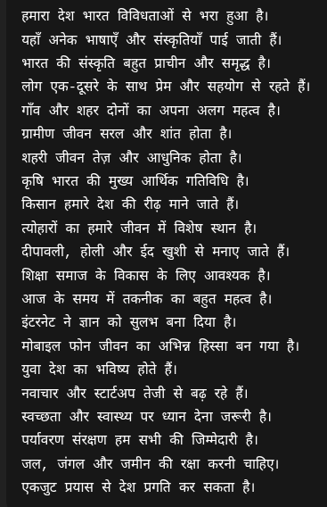
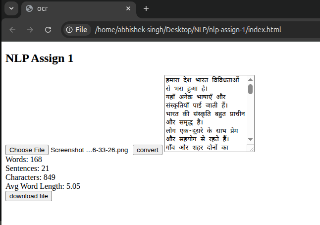

# OCR Text Extraction Web App

This project is a simple **OCR (Optical Character Recognition) web application** that extracts text from an uploaded image and generates basic text statistics.

---

## Features

- Upload image (Hindi / Bhojpuri supported)
- Extract text using **Tesseract.js**
- Display extracted text on the UI
- Generate text statistics:
  - Number of words
  - Number of sentences
  - Number of characters
  - Average word length
- Download extracted text along with statistics as a **DOCX file**

---

## Tech Stack

### Frontend
- HTML
- CSS
- JavaScript (Fetch API)

### Backend
- Node.js
- Express.js
- Multer (file upload)
- Tesseract.js (OCR)
- CORS

---

## 📂 Project Structure

```bash
NLP Assign-1/
│
├── public/
│ ├── index.html
│ ├── script.js
│ └── style.css
│
├── uploads/
│
├── server.js
├── package.json
└── README.md
```

### OCR Language

- OCR is configured for Hindi (hin)
- Works for Bhojpuri text written in Devanagari script


### screenshot


