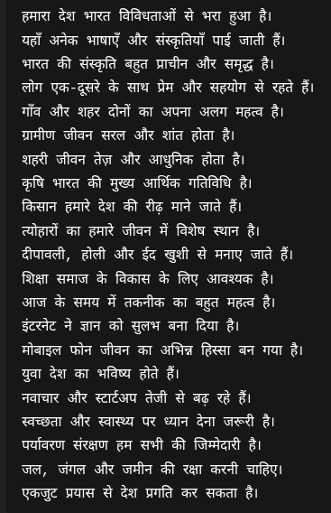
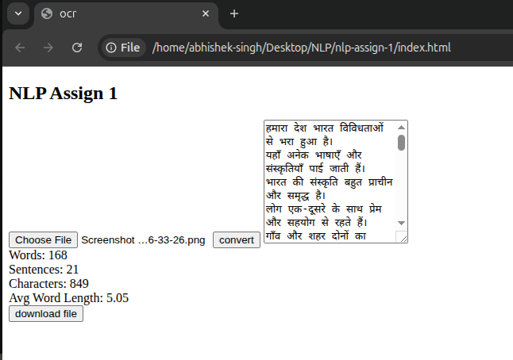

# OCR Text Extraction Web App

This project is a simple **OCR (Optical Character Recognition) web application** that extracts text from an uploaded image and generates basic text statistics.

---

## Features

- Upload image (Hindi / Bhojpuri supported)
- Extract text using **Tesseract.js**
- Display extracted text on the UI
- Generate text statistics:
  - Number of words
  - Number of sentences
  - Number of characters
  - Average word length
- Download extracted text along with statistics as a **DOCX file**
- Spell checking with edit distances (Hamming, LCS, Levenshtein, Zaro/Jaro)
- Hindi dictionary support via `corpus/hindi_words.txt`

---

## BPE (Part 1)

This project includes a simple BPE trainer for the Hindi corpus.

**Run:**

```bash
node scripts/bpe_train.js corpus/hindi_words.txt outputs/bpe 5000 5000
node scripts/bpe_plot_svg.js
```

**Outputs:**
- `outputs/bpe/bpe_<vocab>_vocab.txt`
- `outputs/bpe/bpe_<vocab>_merges.txt`
- `outputs/bpe/bpe_<vocab>_top_tokens.txt`
- `outputs/bpe/bpe_<vocab>_top_merges.txt`
- `outputs/bpe/bpe_<vocab>_examples.txt`
- `outputs/bpe/metrics.json`
- `outputs/bpe/metrics.csv`
- `outputs/bpe/plots/*.svg`
- `outputs/bpe/report.md`

---

## Byte-level BPE (Part 2)

**Run:**

```bash
node scripts/byte_bpe_train.js corpus/hindi_words.txt outputs/byte_bpe 5000 5000
node scripts/byte_bpe_eval.js corpus/hindi_words.txt outputs/byte_bpe 32000 5000
```

**Outputs:**
- `outputs/byte_bpe/byte_bpe_<vocab>_vocab.txt`
- `outputs/byte_bpe/byte_bpe_<vocab>_merges.txt`
- `outputs/byte_bpe/byte_bpe_<vocab>_top_tokens.txt`
- `outputs/byte_bpe/byte_bpe_<vocab>_top_merges.txt`
- `outputs/byte_bpe/byte_bpe_<vocab>_examples.txt`
- `outputs/byte_bpe/metrics.json`
- `outputs/byte_bpe/metrics.csv`
- `outputs/byte_bpe/robustness/robustness_metrics.json`
- `outputs/byte_bpe/robustness/robustness_metrics.csv`
- `outputs/byte_bpe/robustness/*_examples.txt`
- `outputs/byte_bpe/report.md`

---

## Fairness & Bias (Part 3)

**Run:**

```bash
node scripts/fairness_dataset.js corpus/hindi_words.txt outputs/fairness 5000
node scripts/fairness_eval.js outputs/fairness/fairness_dataset.tsv outputs/byte_bpe 32000
```

**Outputs:**
- `outputs/fairness/fairness_dataset.tsv`
- `outputs/fairness/fairness_metrics.csv`
- `outputs/fairness/fairness_metrics.json`
- `outputs/fairness/report.md`

---

## Code-mixed Tokenizer (Part 4)

**Run:**

```bash
node scripts/codemix_dataset.js corpus/hindi_words.txt outputs/codemix 5000
node scripts/codemix_eval.js outputs/codemix/codemix_dataset.tsv outputs/byte_bpe 32000
```

**Outputs:**
- `outputs/codemix/codemix_dataset.tsv`
- `outputs/codemix/codemix_metrics.csv`
- `outputs/codemix/codemix_metrics.json`
- `outputs/codemix/report.md`

---

## Tech Stack

### Frontend
- HTML
- CSS
- JavaScript (Fetch API)

### Backend
- Node.js
- Express.js
- Multer (file upload)
- Tesseract.js (OCR)
- CORS

---

## 📂 Project Structure

```bash
NLP Assign-1/
│
├── public/
│ ├── index.html
│ ├── script.js
│ └── style.css
│
├── uploads/
│
├── server.js
├── package.json
└── README.md
```

### OCR Language

- OCR is configured for Hindi (hin)
- Works for Bhojpuri text written in Devanagari script


### screenshot


